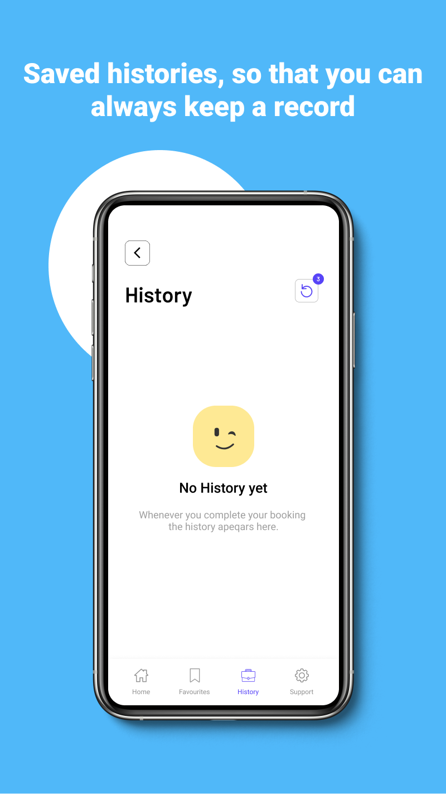

# NinoRooms: choose v1.6 branch for installation

### DEMO:-[watch](https://youtu.be/YIt6e8Sa3dw)

### Playstore Link:-[install it from here](https://play.google.com/store/apps/details?id=nino.rooms.pgcompany)

We, the NinoRooms family, have one purpose: to make everyone feel safe and sound in the warmth and comfort of your homely abode. So we present you with a variety of options, specifically customized to help and satisfy all your needs while bringing you a sense of belongingness with us.
Why should you choose NinoRooms?

### Specification:-
- Affordable and cheap Pg's and Rooms for Renting
- Book Pg's in Several Price range
- Furnished Rooms with all necessary Amenities
- Minimum Security Deposit
- On-demand maintenance 
- No Hassle in Finding Pg's with NinoRooms
- No Paperwork hassle
- Lightweight app
- Clean UserInterface.
- Simple to Use
- And last but not least, we too are students, so we understand students' needs also.

### How to use the app:-

- Just Download and register yourself.
- Find Pg's by Universities Locations.
- View the details and reach out by just clicking on the location.
- If you find anything confusing about room details, you're only one touch away from contacting the owner.

### Sneak peek:-

